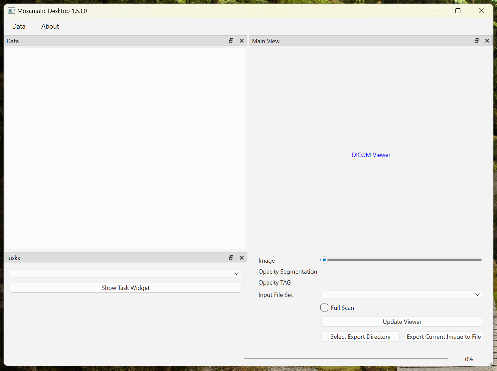
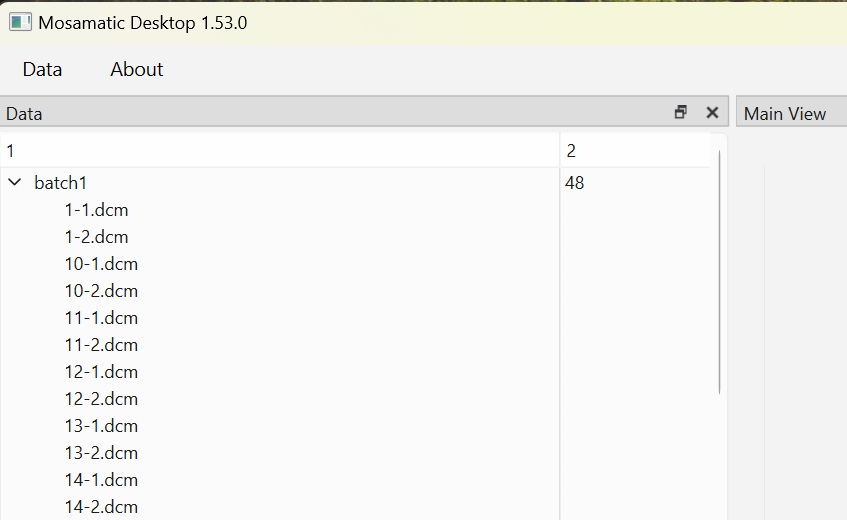
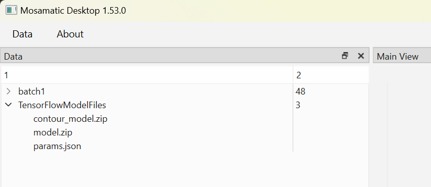

# Mosamatic Desktop
Mosamatic Desktop is a Python tool for (1) automatically annotating muscle and fat tissue in CT images taken at the 3rd lumbar vertebral level and (2) calculating surface area 
and mean radiation attenuation of the muscle and fat compartments visible at L3 level. Given a full CT scan Mosamatic Desktop is also able to automatically select the L3 slice. 
It uses Total Segmentator () for this purpose by first extracting the L3 vertebra, finding its center position in the Z-direction and looking up the DICOM image closest to that
position (by inspecting the ImagePositionPatient attribute).

# Installation
Installing Mosamatic Desktop is as simple as running either InstallMosamatic.bat (Windows) or InstallMosamatic.sh (Linux/MacOS), depending on your platform.

These installation scripts will setup a virtual Python environment for installing and running Mosamatic Desktop. They will also install additional Python pacakages that allow
you to use the GPU on your system (if present). Note that the automatic slice selection task will be very slow if there is no GPU support on your system. You can check whether
you have GPU support by going to "About" > "Application Info" in the main menu of Mosamatic Desktop. If it says "GPU Enabled: True" you're good to go.

## Install Python
- Go to [https://www.python.org](https://www.python.org) and install the most recent Python environment (3.12 as of writing this manual). After installation, test your installation by opening a terminal window by clicking the "Start" button in your Windows task bar and searching for "Terminal". You can also directly go to [https://www.python.org/ftp/python/3.12.6/python-3.12.6-amd64.exe](https://www.python.org/ftp/python/3.12.6/python-3.12.6-amd64.exe).
- In the terminal type "python --version". You should now see some information about the recently installed Python environment, particularly the installed version.

## Install Mosamatic using the InstallMosamatic.bat script
- Find the installation script "InstallMosamatic.bat" in the root directory of the source code project here on GitHub.
- Download the installation script somewhere on your system, e.g., on your Desktop.
- Double-click the installation script. This will start the installation process for Mosamatic. After the script finishes (hopefully successfully), you should see another icon on your desktop "MosamaticDesktop". This is a shortcut pointing to the executable (.exe) of the application.

# Running Mosmatic Desktop
- After successful installation, you can double-click the "MosamaticDesktop" icon on your desktop (if that's where you installed it) to start the application. After a few seconds you should see the main tool window as illustrated in the figure below.

## Loading L3 images
- After starting Mosamatic Desktop, go to "Data" in the top menu and click "Import File Set...".
- A dialog window opens where you can navigate to your a directory containing, e.g., a list of CT images acquired at L3 level. Just select the directory name and click "Ok" to load the dataset. After successful loading of the images, you should now see them displayed in the left "Data" panel as illustrated in the figure below.

## Loading AI model files
The AI model files are just another file set in Mosamatic Desktop so you also have to load them using the "Data" > "Import File Set..." menu. 
- First create a directory somewhere on your system, e.g., on your desktop called "TensorFlowModelFiles" (or some other name)
- Then download each AI model file to this directory on your system. The model files can be found in the "assets" directory of the source code project or from the following links: [model.zip](https://mosamatic.rbeesoft.nl/data/model.zip), [contour_model.zip](https://mosamatic.rbeesoft.nl/data/contour_model.zip), [params.json](https://mosamatic.rbeesoft.nl/data/params.json). The params.json file may just display in your browser after clicking it. You can actually download it by selecting the whole text and copy-pasting it into a text file (in the local directory) called "params.json".
- Now that you have the AI model files in the local directory, you can import this directory as a file set in Mosamatic Desktop. This should look as illustrated in the following figure

## Analyzing body composition
After you have loaded the AI model files and a file set with L3 images you can proceed to run the body composition analysis steps as follows:
- 