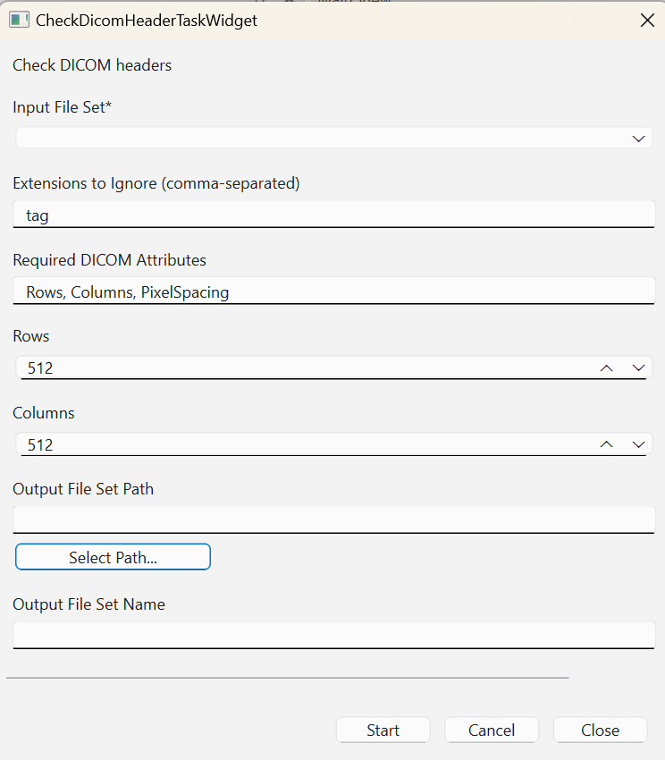

# Mosamatic Desktop
Mosamatic Desktop is a Python tool for (1) automatically annotating muscle and fat tissue in CT images taken at the 3rd lumbar vertebral level and (2) calculating surface area 
and mean radiation attenuation of the muscle and fat compartments visible at L3 level. Given a full CT scan Mosamatic Desktop is also able to automatically select the L3 slice. 
It uses Total Segmentator () for this purpose by first extracting the L3 vertebra, finding its center position in the Z-direction and looking up the DICOM image closest to that
position (by inspecting the ImagePositionPatient attribute).

# Installation
Installing Mosamatic Desktop is as simple as running either InstallMosamatic.bat (Windows) or InstallMosamatic.sh (Linux/MacOS), depending on your platform.

These installation scripts will setup a virtual Python environment for installing and running Mosamatic Desktop. They will also install additional Python pacakages that allow
you to use the GPU on your system (if present). Note that the automatic slice selection task will be very slow if there is no GPU support on your system. You can check whether
you have GPU support by going to "About" > "Application Info" in the main menu of Mosamatic Desktop. If it says "GPU Enabled: True" you're good to go.

<!-- ## Install Python
- Go to [https://www.python.org](https://www.python.org) (open in new browser tab) and install the most recent Python environment (3.12 as of writing this manual). After installation, test your installation by opening a terminal window by clicking the "Start" button in your Windows task bar and searching for "Terminal". You can also directly go to [https://www.python.org/ftp/python/3.12.6/python-3.12.6-amd64.exe](https://www.python.org/ftp/python/3.12.6/python-3.12.6-amd64.exe) (open in new browser tab).
- In the terminal type "python --version". You should now see some information about the recently installed Python environment, particularly the installed version. -->

## Install Mosamatic using the InstallMosamatic.bat script
- Find the installation script "InstallMosamatic.bat" in the root directory of the source code project here on GitHub.
- Download the installation script somewhere on your system, e.g., on your Desktop.
- Double-click the installation script. This will start the installation process for Mosamatic. After the script finishes (hopefully successfully), you should see another icon on your desktop "MosamaticDesktop". This is a shortcut pointing to the executable (.exe) of the application. If Python has not yet been installed, it will be installed through this script as well. Mosamatic Desktop requires Python 3.11. Later versions may not work due to version conflicts with the AI functionality in the tool (to be fixed later).

# Running Mosmatic Desktop
- After successful installation, you can double-click the "MosamaticDesktop" icon on your desktop (if that's where you installed it) to start the application. After a few seconds you should see the main tool window as illustrated in the figure below:

## Loading L3 images
- After starting Mosamatic Desktop, go to "Data" in the top menu and click "Import File Set...".
- A dialog window opens where you can navigate to your a directory containing, e.g., a list of CT images acquired at L3 level. Just select the directory name and click "Ok" to load the dataset. After successful loading of the images, you should now see them displayed in the left "Data" panel as illustrated in the figure below.

## Loading AI model files
The AI model files are just another file set in Mosamatic Desktop so you also have to load them using the "Data" > "Import File Set..." menu. 
- First create a directory somewhere on your system, e.g., on your desktop called "TensorFlowModelFiles" (or some other name)
- Then download each AI model file to this directory on your system. The model files can be found in the "assets" directory of the source code project or from the following links: [model.zip](https://mosamatic.rbeesoft.nl/data/model.zip), [contour_model.zip](https://mosamatic.rbeesoft.nl/data/contour_model.zip), [params.json](https://mosamatic.rbeesoft.nl/data/params.json). The params.json file may just display in your browser after clicking it. You can actually download it by selecting the whole text and copy-pasting it into a text file (in the local directory) called "params.json".
- Now that you have the AI model files in the local directory, you can import this directory as a file set in Mosamatic Desktop. This should look as illustrated in the figure below:

## Analyzing body composition
After you have loaded the AI model files and a file set with L3 images you use a number of tasks to do body composition analysis as illustrated in the figure below:

### Checking DICOM attributes
Start with checking whether your L3 DICOM files have the correct dimensions (512 x 512) and contain the required DICOM attributes for successful analysis. For that, select the "CheckDicomHeaderTask". Click the button "Show Task Widget" to display a dialog window with parameters for this task as illustrated in the figure below:

<!--  -->

- In the "Input File Set" field, select the L3 file set you imported previously
- Leave the "Input Extensions to Ignore" unchanged
- Leave the "Required DICOM Attributes" field unchanged
- Leave the "Rows" field unchanged
- Leave the "Columns" field unchanged
- In the "Output File Set Path", navigate and select the directory where you want to save a new directory for holding the output results. This new directory will be created automatically and the output results saved in it
- In the "Output File Set Name", specify the name of for the new directory that will be created. Ideally, this is the same name as the original input file set but with "_checked" appended to the file name.
- Click the "Start" button to execute the task and wait until the progress bar has reached 100%
- Click the "Close" button to close the window

After running the check DICOM task you see a new file set appear in the "Data" panel that contains all L3 images that passed the DICOM check. If there are images with certain problems, e.g., wrong dimensions (rows or columns) then these will be skipped and will not end up in the output file set.

### Running muscle and fat segmentation
When the DICOM check task has succeeded, select the "MuscleFatSegmentationTask" and click the button "Show Task Widget". This will show a dialog window where you can specify a number of task parameters before you actually execute the task as illustrated in the figure below:

- In the "Input File Set" field, select the *checked* DICOM L3 file set you created in the previous task run
- In the "TensorFlow Model File Set", select the AI model file set you imported previously
- Leave the "Mode" field unchanged (default: ARGMAX)
- In the "Output File Set Path", navigate and select the directory where you want to save a new directory for holding the output results. This new directory will be created automatically and the output results saved in it
- In the "Output File Set Name", specify the name of for the new directory that will be created. Ideally, this file set has the same name as the checked DICOM file set but with "_segmentations" appended to the file name, so if "L3_files" was the name of the original file set and "L3_files_checked" the name of the checked file set, name this one "L3_files_checked_segmentation".
- Click the "Start" button to execute the task and wait until the progress bar has reached 100%
- Click the "Close" button to close the window

After running the muscle and fat segmentation task you will see it appear in the "Data" panel.

### Calculating body composition metrics
Now that we have a checked file set and segmentations from the previous two tasks, we can start calculating body composition metrics. For this, select the "CalculateBodyCompositionMetricsTask" and click the "Show Task Widget" button. This will show a dialog window where you can specify the parameters for this task as illustrated in the following figure:

- In the "Input DICOM (and TAG) File Set", select the *checked* DICOM L3 file set you created in the first task run
- In the "Input Segmentation File Set", select the segmentations file set you created in the muscle and fat segmentation task run
- Leave the "Patient Height CSV File Set Path" field unchanged (empty)
- In the "Output File Set Path", navigate and select the directory where you want to save a new directory for holding the output results. This new directory will be created automatically and the output results saved in it
- In the "Output File Set Name", specify the name of for the new directory that will be created. Ideally, this file set has the same name as the checked DICOM file set but with "_scores" appended to the file name, so if "L3_files" was the name of the original file set and "L3_files_checked" the name of the checked file set, name this one "L3_files_checked_scores".
- Click the "Start" button to execute the task and wait until the progress bar has reached 100%
- Click the "Close" button to close the window

After running this task a new output file set will have been created that contains the body composition metrics for all L3 files. It will appear in the "Data" panel.

### Creating PNG images of the L3 DICOM files
For publication in an article you may want to create PNG images of relevant imaging files. For this, you can select the "CreatePngFromDicomFileTask" and click the "Show Task Widget" button. This will display a dialog window where you can specify the parameters for this task as illustrated in the following figure:

- In the "Input File Set" field, select the *checked* DICOM L3 file set you created in the first task run
- Leave the "Window Level" field unchanged (default: 50). This setting is optimal for CT
- Leave the "Window Width" field unchanged (default: 400). This setting is optimal for CT
- In the "Output File Set Path", navigate and select the directory where you want to save a new directory for holding the output results. This new directory will be created automatically and the output results saved in it
- In the "Output File Set Name", specify the name of for the new directory that will be created. Ideally, this file set has the same name as the checked DICOM file set but with "_png" appended to the file name, so if "L3_files" was the name of the original file set and "L3_files_checked" the name of the checked file set, name this one "L3_files_checked_png".
- Click the "Start" button to execute the task and wait until the progress bar has reached 100%
- Click the "Close" button to close the window

After running this task a new output file set will have been created that contains the PNG images for all L3 files. It will appear in the "Data" panel.

### Creating PNG images of the segmentation files
For publication in an article you may want to create PNG images of relevant imaging files. For this, you can select the "CreatePngFromSegmentationFileTask" and click the "Show Task Widget" button. This will display a dialog window where you can specify the parameters for this task as illustrated in the following figure:

- In the "Input File Set" field, select the segmentation file set (ending in "_segmentations") you created previously
- In the "Output File Set Path", navigate and select the directory where you want to save a new directory for holding the output results. This new directory will be created automatically and the output results saved in it
- In the "Output File Set Name", specify the name of for the new directory that will be created. Ideally, this file set has the same name as the segmentation file set but with "_png" appended to the file name, so if "L3_files" was the name of the original file set, "L3_files_checked" the name of the checked file set, and "L3_files_checked_segmentations" the name of the segmentations file set, name this one "L3_files_checked_segmentations_png".
- Click the "Start" button to execute the task and wait until the progress bar has reached 100%
- Click the "Close" button to close the window

After running this task a new output file set will have been created that contains the PNG images for all segmentation files. It will appear in the "Data" panel.

### Creating a ZIP archive
For easy distribution of the output files to others, you can compress all output files in a ZIP archive file by selecting the "CreateArchiveTask" and clicking the "Show Task Widget" button. This will display a dialog window where you can specify the parameters for this task as illustrated in the following figure:

- In the "Input File Sets" field, select all output files you wish to include in the ZIP archive. For example, this could the *checked* DICOM L3 files, the segmentation files, the body composition scores, the DICOM PNG images, and the segmentation PNG files. For each file set, click the "Add" button to add it to the list of files to be included in the ZIP archive.
- In the "Output File Set Path", navigate and select the directory where you want to save a new directory for holding the output results. This new directory will be created automatically and the output results saved in it
- In the "Output File Set Name", specify the name of for the new directory that will be created. Ideally, this file set has the same name as the *checked* DICOM L3 file set but with "_archive" appended to the file name, so if "L3_files" was the name of the original file set, and "L3_files_checked" the name of the checked file set, name this one "L3_files_checked_archive".
- Click the "Start" button to execute the task and wait until the progress bar has reached 100%
- Click the "Close" button to close the window
